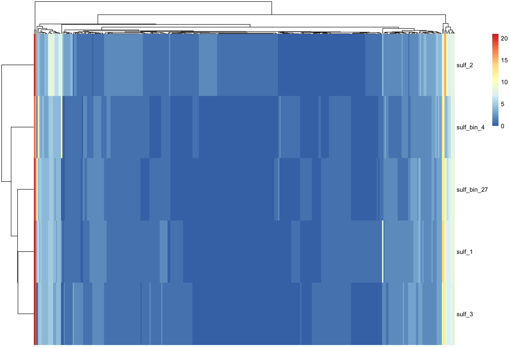

```{r setup, include=F}
library(tidyverse)
library(knitr)
library(Biostrings)
library(pheatmap)
opts_chunk$set(
  echo = TRUE,         # Display code chunks
  eval = FALSE,        # Don't evaluate code chunks
  warning = FALSE,     # Hide warnings
  message = FALSE,     # Hide messages
  fig.width = 6,       # Set plot width in inches
  fig.height = 4,      # Set plot height in inches
  fig.align = "center" # Align plots to the center
)
```

DOI: https://doi.org/10.5281/zenodo.7967443

I have 4 total documents detailing my project. Here are all 4 in order, including this one:

https://rpubs.com/jwinter2/ssu16s

https://rpubs.com/jwinter2/bin-annotate-01

https://rpubs.com/jwinter2/anvio-02

https://rpubs.com/jwinter2/ko-03

# Overview of project {-}

I am working with metagenomic data from the Eastern Tropical North Pacific oxygen deficient zone (ODZ). My data comes from 585 m, a region within the oxygen deficient zone with abundant Marinimicrobia and Sulfitobacter. For this project, I created a pangenome of Sulfitobacter and a presence-absence plot of genes. Sulfitobacter pontiacus is a cultured species of sulfur oxidizing bacteria that has previously been described as aerobic, yet it is found within the ODZ. This workflow, while for Sulfitobacter, can be adapted to work with Marinimicrobia, an uncultured phylum of bacteria involved in nitrogen and sulfur cycling in extreme environments. My next step is to further investigate the Sulfitobacter plasmids via genome synteny.

Workflow of code:

- 00_16S: Check that Sulfitobacter sequences are Sulfitobacter pontiacus by aligning 16S sequences and making a phylogenetic tree
- 01-annotating-bins: Get completion, redundancy, and other statistics on different binning methods for Sulfitobacter
- 02-anvio: Create pangenome of Sulfitobacter in anvio using my bins and reference genomes
- 03-ko: Create presence-absence plots using Kegg orthologs

Final figure:



*This document goes over 16S annotation*

# Getting 16S reads {-}

Get all reads for Sulfitobacter based on taxonomic classification by Silva. My reads are most likely *Sulfitobacter pontiacus*, but I need to check by putting the sequences on a phylogenetic tree.

```{r, eval=T}
tax <- read.csv("~/Downloads/16S_mar/silva_all_reads_resultlist.csv")
sulf <- subset(tax, lca_tax_slv == "Bacteria;Proteobacteria;Alphaproteobacteria;Rhodobacterales;Rhodobacteraceae;Sulfitobacter;")

fasta <- readDNAStringSet("~/Downloads/16SrRNA_all_reads.fa")
fasta_names <- sulf$sequence_identifier
fasta_sulf <- fasta[sapply(fasta_names, function(x) charmatch(x, names(fasta)))]
writeXStringSet(fasta_sulf, '~/Downloads/sulf_16S_all_reads.fa')
fasta_sulf
```

# Aligning sequences {-}

Next, I got additional Sulfitobacter 16S sequences and some outgroups from SILVA to use on my phylogenetic tree. Then I used SSU-align in Terminal to align the sequences. Use --gapthresh 0.9 if you want to clean up the gaps.

```{bash}
ssu-align sulf_ref_and_mine.fa sulf_align
ssu-mask sulf_align --afa
```

After aligning, I viewed the aligned sequences in AliView to make sure the alignment looked reasonable. I exported the AliView file to change the . to - in the fasta file (the . just indicated areas that could be misaligned, so a - was put there to not "count" those towards the maximum likelihood tree).


# Making a Sulfitobacter species phylogenetic tree {-}

I ran RAxML to make tree. This is an example of what to run-- I use the RAxML GUI (https://antonellilab.github.io/raxmlGUI/). I use the GTR gamma model, and initially did not bootstrap to save some time. The goal was to see if my sequences ended up with the known *Sulfitobacter pontiacus* sequences.

```{r, engine='bash'}
/Applications/raxmlGUI.app/Contents/Resources/static/bin/raxml-ng --all --msa Downloads/contigs_and_clades_fixed_modified.fasta --model GTR+G --prefix Downloads/contigs_and_clades_fixed_raxml/contigs_and_clades_fixed_1 --seed 221239 --outgroup AJ430587_Caldithrix_abyssi --bs-metric tbe --tree rand{1} --bs-trees 100
```

Once I had the maximum likelihood (ML) tree, I visualized it in ITOL (https://itol.embl.de) and manually curated the reads into their species based on their nearest neighbors. While not all species were monophyletic, most were, and all of my 16S reads grouped with *Sulfitobacter pontiacus*.


# Plotting Sulfitobacter 16S with depth {-}

After verifying my sequences were *Sulfitobacter pontiacus*, I plotted their distribution with depth at the ODZ stations. Almost all the *Sulfitobacter pontiacus* was found at P1, the coastal station (still within the oxygen deficient zone), and at 585 m.

```{r, eval = T}
# read in data
all <- read.csv("~/Downloads/16S_mar/silva_all_reads_resultlist.csv")

# get metadata into readable columns
all$code <- str_split_fixed(all$sequence_identifier, "___", 3)[,3]
unclassified <- which(all$lca_tax_slv == "Unclassified;")
all$lca_tax_slv[unclassified] <- "Unclassified;Unclassified"
all$phylum <- str_split_fixed(all$lca_tax_slv, ";", 20)[,2]
test2 <- str_split_fixed(all$full_name, "[|]", 8)
all$bin_id <- test2[,1]
all$contig <- test2[,4]
all$contig <- str_split_fixed(all$contig, ":", 2)[,2]
all$year <- str_split_fixed(all$bin_id, "_", 7)[,4]
all$sizefrac <- str_split_fixed(all$bin_id, "_", 7)[,6]
all$depth <- str_split_fixed(all$bin_id, "_", 7)[,5]
all$depth <- as.integer(as.character(all$depth))
all$station <- str_split_fixed(all$bin_id, "_", 7)[,3]

# subset data for Sulfitobacter in the small size fraction at P1 and P2
sulf <- subset(all, lca_tax_slv == "Bacteria;Proteobacteria;Alphaproteobacteria;Rhodobacterales;Rhodobacteraceae;Sulfitobacter;" & sizefrac != "3um" & station != "P3")

# make depth plot
depth <- ggplot(sulf, aes(x=depth)) + 
     geom_bar(width=20) +
     theme_bw() +
     coord_flip() +
     facet_wrap(~station) + 
     scale_x_reverse() +
     xlab("Depth (m)") +
     ylab("Number of Sulfitobacter pontiacus 16S reads")
depth
```
