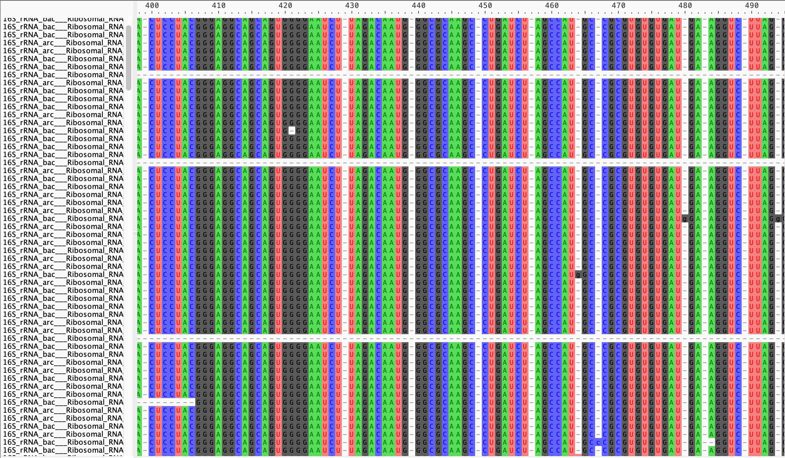

```{r setup, include=F}
library(tidyverse)
library(knitr)
opts_chunk$set(
  echo = TRUE,         # Display code chunks
  eval = FALSE,        # Don't evaluate code chunks
  warning = FALSE,     # Hide warnings
  message = FALSE,     # Hide messages
  fig.width = 6,       # Set plot width in inches
  fig.height = 4,      # Set plot height in inches
  fig.align = "center" # Align plots to the center
)
```

*This document goes over 16S annotation*

# Getting 16S reads

Get all reads for Sulfitobacter

```{r, eval=T}
tax <- read.csv("~/Downloads/16S_mar/silva_all_reads_resultlist.csv")
sulf <- subset(tax, lca_tax_slv == "Bacteria;Proteobacteria;Alphaproteobacteria;Rhodobacterales;Rhodobacteraceae;Sulfitobacter;")

fasta <- readDNAStringSet("~/Downloads/16SrRNA_all_reads.fa")
fasta_names <- sulf$sequence_identifier
fasta_sulf <- fasta[sapply(fasta_names, function(x) charmatch(x, names(fasta)))]
writeXStringSet(fasta_sulf, '~/Downloads/sulf_16S_all_reads.fa')
fasta_sulf
```

# Aligning sequences

Next, I got Sulfitobacter 16S sequences and outgroups from SILVA. Then I used SSU-align to align the sequences.

```{bash}
ssu-align sulf_ref_and_mine.fa sulf_align
ssu-mask sulf_align
ssu-mask --stk2afa sulf_align
```

After aligning, I viewed the aligned sequences in AliView to make sure the alignment looked reasonable. I exported the AliView file to change the . to - in the fasta file (the . just indicated areas that could be misaligned, so a - was put there to not "count" those towards the ML tree).



# Making a tree

Run RAxML to make tree. This is an example of what to run, I use the RAxML GUI. I use the GTR gamma model, and initially did not bootstrap to save some time.

```{r, engine=bash}
/Applications/raxmlGUI.app/Contents/Resources/static/bin/raxml-ng --all --msa Downloads/contigs_and_clades_fixed_modified.fasta --model GTR+G --prefix Downloads/contigs_and_clades_fixed_raxml/contigs_and_clades_fixed_1 --seed 221239 --outgroup AJ430587_Caldithrix_abyssi --bs-metric tbe --tree rand{1} --bs-trees 100
```

Once I had the maximum likelihood (ML) tree, I visualized it in ITOL (itol.embl.de) and manually curated the reads into their species based on the results. While not all species were monophyletic, most were, and all of my 16S reads grouped with Sulfitobacter pontiacus.


# Plotting Sulfitobacter 16S with depth

Almost all the Sulfitobacter pontiacus was found at P1, the coastal station (still within the oxygen deficient zone), and at 585 m.

```{r, eval = T}
all <- read.csv("~/Downloads/16S_mar/silva_all_reads_resultlist.csv")
all$code <- str_split_fixed(all$sequence_identifier, "___", 3)[,3]
unclassified <- which(all$lca_tax_slv == "Unclassified;")
all$lca_tax_slv[unclassified] <- "Unclassified;Unclassified"
all$phylum <- str_split_fixed(all$lca_tax_slv, ";", 20)[,2]
test2 <- str_split_fixed(all$full_name, "[|]", 8)
all$bin_id <- test2[,1]
all$contig <- test2[,4]
all$contig <- str_split_fixed(all$contig, ":", 2)[,2]
all$year <- str_split_fixed(all$bin_id, "_", 7)[,4]
all$sizefrac <- str_split_fixed(all$bin_id, "_", 7)[,6]
all$depth <- str_split_fixed(all$bin_id, "_", 7)[,5]
all$depth <- as.integer(as.character(all$depth))
all$station <- str_split_fixed(all$bin_id, "_", 7)[,3]
sulf <- subset(all, lca_tax_slv == "Bacteria;Proteobacteria;Alphaproteobacteria;Rhodobacterales;Rhodobacteraceae;Sulfitobacter;" & sizefrac != "3um" & station != "P3")
a <- ggplot(sulf, aes(x=depth)) + 
     geom_bar(width=20) +
     theme_bw() +
     coord_flip() +
     facet_wrap(~station) + 
     scale_x_reverse() +
     xlab("Depth (m)") +
     ylab("Number of 16S reads")
a
```
