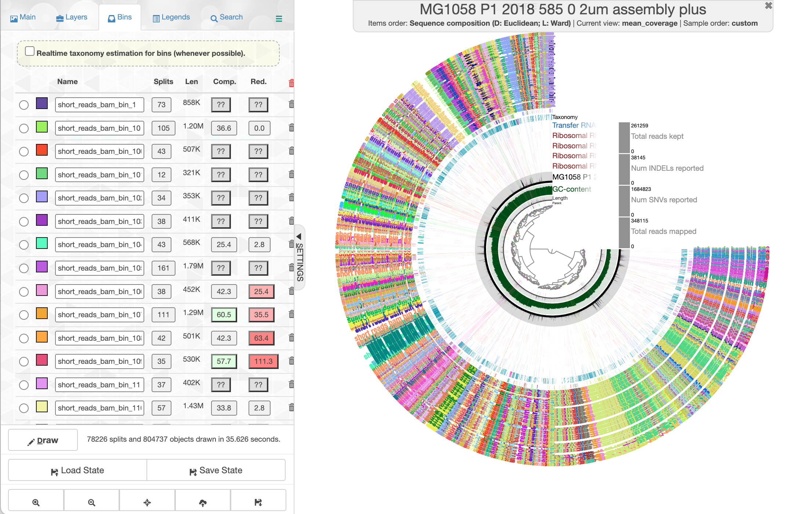
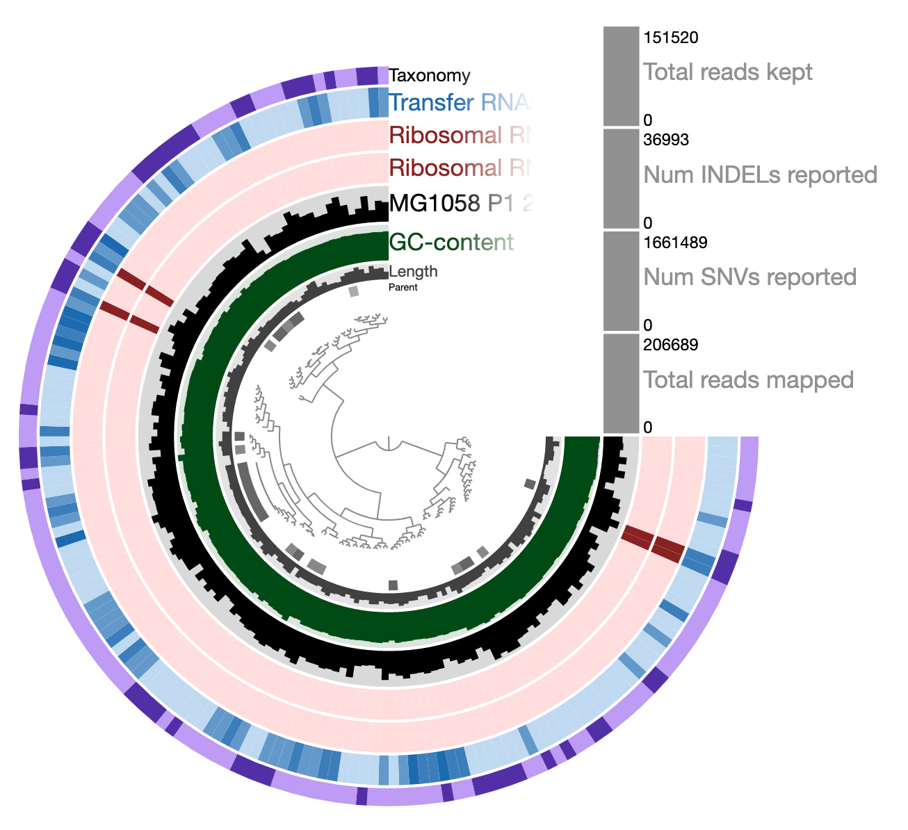
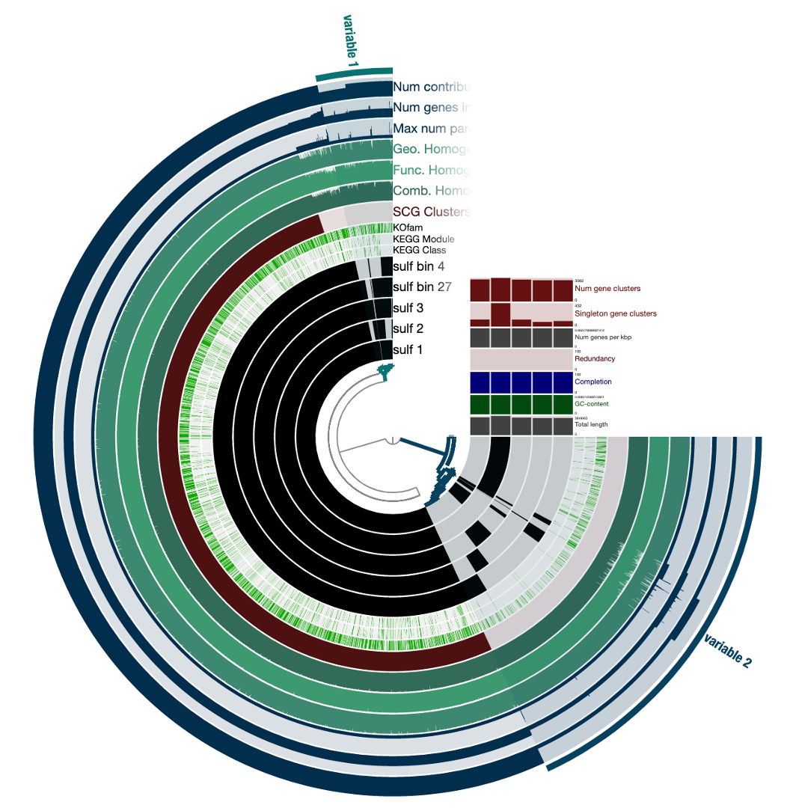

```{r setup, include=F}
library(tidyverse)
library(knitr)
opts_chunk$set(
  echo = TRUE,         # Display code chunks
  eval = FALSE,        # Don't evaluate code chunks
  warning = FALSE,     # Hide warnings
  message = FALSE,     # Hide messages
  fig.width = 6,       # Set plot width in inches
  fig.height = 4,      # Set plot height in inches
  fig.align = "center" # Align plots to the center
)
```

*This document details visualization in anvio*

Anvio is run in a dedicated environment.

```{bash}
conda activate anvio-7.1
```

# Get bin info {-}

Get bin info into a format that anvio can use. This means concatenating the bin files for each method, so there's a list of which contig/read goes in which bin

```{r}
path <- list.dirs("../data/Bins")

for (i in 2:7){
  
  DF <- NULL
  
  pathname <- path[i]
  filelist <- list.files(paste0(pathname, "/"))
  
  for (filename in filelist){
    df <- read.csv(paste0(pathname, "/", filename), header = F)
    df <- as.data.frame(df)
    colnames(df) <- "read"
    df$bin <- str_replace(filename, "[.]", "_")
    if (basename(pathname) == "24_sample_bam_bins"){
      df$bin <- str_replace(df$bin, "24", "twentyfour")
    }
    if (basename(pathname) == "47_sample_bam_bins"){
      df$bin <- str_replace(df$bin, "47", "fortyseven")
    }
    DF <- rbind(DF, df) 
  }
  
  write.table(DF, paste0("../output/all_bins/", basename(pathname), ".tsv"), row.names = F, col.names = F, quote = F, sep = "\t")
  
}
```

Examine tsv files.

```{r, eval=T}
tsv_output <- read.csv("../output/all_bins/assembly_bins.tsv", sep = "\t")
kable(head(tsv_output, 5))
```

# Import bins into anvio {-}

Get the bins into the anvio database already created.

```{bash}
# Example for one bin import, change import and -C for each
anvi-import-collection "./github/jordan-marinimicrobia/output/all_bins/short_reads_bam_bins.tsv" -p "./Downloads/plus_PROFILE.db" -c "./Library/CloudStorage/GoogleDrive-jwinter2@uw.edu/Shared drives/Rocap Lab/Project_ODZ_Marinimicrobia_Jordan/Anvio/assembly_plus/1058_P1_2018_585_0.2um_assembly_plus.db" --contigs-mode -C shortreads
```

# Run interactive browser {-}

```{bash}
anvi-interactive -p "./Downloads/plus_PROFILE.db" -c "./Library/CloudStorage/GoogleDrive-jwinter2@uw.edu/Shared drives/Rocap Lab/Project_ODZ_Marinimicrobia_Jordan/Anvio/assembly_plus/1058_P1_2018_585_0.2um_assembly_plus.db"
```

Example of what the interactive browser looks like with bins.



# Refine bins {-}

Dig into "contaminated" bins to see how/why they are contaminated. Reminder that "." is changed to "_" and 24 and 47 are written out in the anvi bin database.

```{bash}
anvi-refine -p "./Downloads/assembly_PROFILE.db" -c "./Library/CloudStorage/GoogleDrive-jwinter2@uw.edu/Shared drives/Rocap Lab/Project_ODZ_Marinimicrobia_Jordan/Anvio/assembly_only/1058_P1_2018_585_0.2um_assembly.db" -C shortreads -b short_reads_bam_bin_163
```

Example of a contaminated bin.



# Get summary statistics {-}

```{r, eval=T}
summary <- read.table("../output/anvio_outputs/assembly_plus_summary.txt", sep = "\t", header = T)
summary(summary)
```

# Creating pangenome {-}

Creating anvio dbs for my bins

```{bash}
anvi-gen-contigs-database -f sulf_genomes/assembly_plus_bin_4.fa -o sulfbin4.db

anvi-run-hmms -c sulf_genomes/dbs/sulfbin4.db
anvi-run-scg-taxonomy -c sulf_genomes/dbs/sulfbin4.db
anvi-scan-trnas -c sulf_genomes/dbs/sulfbin4.db
anvi-run-ncbi-cogs -c sulf_genomes/dbs/sulfbin4.db
anvi-run-kegg-kofams -c sulf_genomes/dbs/sulfbin4.db

anvi-gen-genomes-storage -e sulf-external-genomes.txt \
                         -o sulf-GENOMES.db

anvi-pan-genome -g sulf-GENOMES.db -n sulfitobacter

anvi-display-pan -g sulf-GENOMES.db -p sulfitobacter/sulfitobacter-PAN.db
```

Pangenome visualization.


