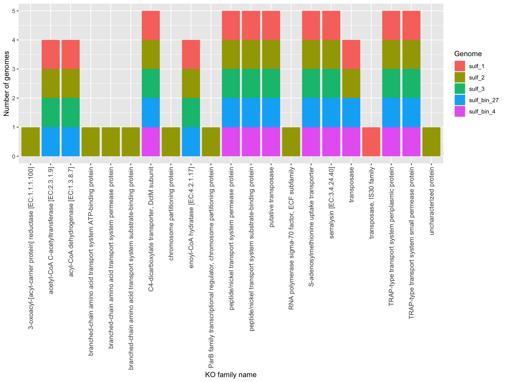
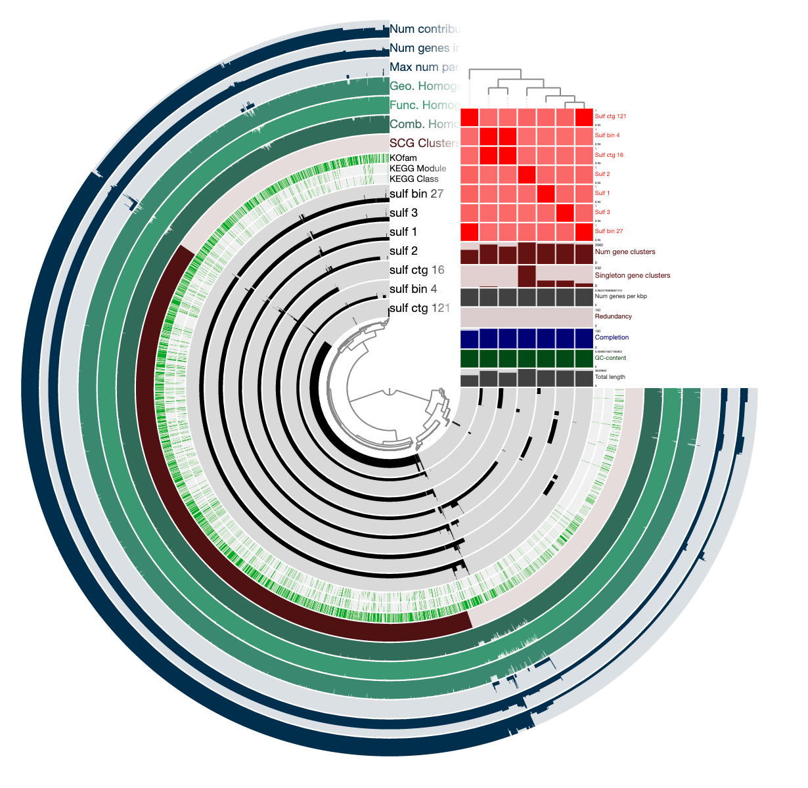
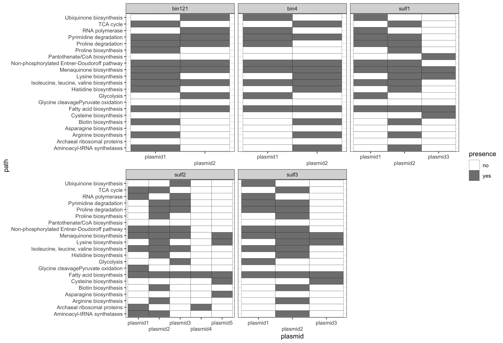

```{r setup, include=F}
library(tidyverse)
library(knitr)
library(pheatmap)
library(DT)
library(stringr)
opts_chunk$set(
  echo = TRUE,         # Display code chunks
  eval = FALSE,        # Don't evaluate code chunks
  warning = FALSE,     # Hide warnings
  message = FALSE,     # Hide messages
  fig.width = 6,       # Set plot width in inches
  fig.height = 4,      # Set plot height in inches
  fig.align = "center" # Align plots to the center
)
```

*This document details Kegg pathways and creation of the heatmap*

# Get summary stats on genomes {.unnumbered}

Get Kegg orthologs for all regions in the pangenome. This is done in anvio by using the "summarize" option in anvi interactive.

```{r, eval=T}
summary <- read.csv("../output/pangenome_gene_clusters_summary.txt", sep = "\t")
summary <- summary[,3:18]

datatable(summary[1:100,])
```

# Plot of specific aerobic genes {.unnumbered}

I am looking for genes involved in aerobic respiration to get at the question of why these microbes are in the ODZ. Do they have aerobic respiration genes, or are they only anaerobic? Based on these results, it seems like they may be facultative anaerobes or completely aerobic and involved in the cryptic oxygen cycle in the ODZ.

```{r, eval=T}
genes <- read.csv("~/Downloads/sulf_genomes/sulfitobacter/SUMMARY_variable_region/sulfitobacter_gene_clusters_summary.txt", sep = "\t")

ko_of_interest <- read.csv("~/Downloads/sulf_genomes/KO_of_interest.csv")

# choose genes you want to plot
ko_of_interest <- subset(ko_of_interest, pathway == "terminal oxidase")

index <- str_detect(genes$KOfam_ACC, paste(ko_of_interest$ko, collapse = "|"))
genes_small <- genes[which(index),]

genes <- ggplot(genes_small) +
  geom_bar(aes(KEGG_Module, fill = bin_name)) +
  theme_bw() +
  facet_wrap(~genome_name) +
  scale_x_discrete(guide = guide_axis(angle = 90))
genes
```

# Heatmap for different genes {.unnumbered}

Create a heatmap of the variable regions of each genome. It appears that one of my bins, sulf_bin_4 is a bit different than the otehr three at the far right and that one of the cultured genomes, sulf_2, is more different than the other 4 genomes.

```{r, eval=T}
summary <- read.csv("../output/pangenome_gene_clusters_summary.txt", sep = "\t")
summary <- summary[,c("genome_name", "KOfam_ACC")]
summary <- subset(summary, KOfam_ACC != "" & genome_name != "sulf_ctg_121" & genome_name != "sulf_ctg_16")

heat_matrix <- as.matrix(table(summary$genome_name, summary$KOfam_ACC))

#heatmap_all <- pheatmap(heat_matrix, show_colnames=F)

index <- NULL
for (i in 1:ncol(heat_matrix)){
  if (length(unique(heat_matrix[,i])) > 1){
    index[i] <- TRUE
  } else {
    index[i] <- FALSE
  }
}
matrix_small <- heat_matrix[,which(index == TRUE)]

heatmap <- pheatmap(matrix_small, show_colnames=F)
heatmap
```

Look at areas with many of the same KO. Some of these genes may be on plasmids.

```{r}
# get list of columns with more than 5 genes
index <- which(matrix_small > 5, arr.ind=T)
index <- as.data.frame(index)
index$row <- rownames(index)
index$row <- str_split_fixed(index$row, "[.]", 2)[,1]

# get KO for each column
columns <- as.data.frame(colnames(matrix_small))
colnames(columns) <- "KO"
columns$col <- rownames(columns)
lots_genes <- merge(index, columns)

# get annotations for KO numbers
summary <- read.csv("../output/pangenome_gene_clusters_summary.txt", sep = "\t")
summary <- summary[,c("KOfam", "KOfam_ACC")]
colnames(summary) <- c("KOname", "KO")
summary <- unique(summary)
lots_genes <- merge(lots_genes, summary)
lots_genes <- lots_genes[, c("row", "KOname")]
lots_genes <- unique(lots_genes)

# plot results
many <- ggplot(lots_genes) +
  geom_bar(aes(x=KOname, fill=row)) +
  theme(axis.text.x = element_text(angle = 90, vjust = 0.5, hjust=1, size=10)) +
  ylab("Number of genomes") +
  xlab("KO family name") +
  scale_fill_discrete(name = "Genome")
many
```



# Compute genome similarity {.unnumbered}

Look at genome similarity. The cutoff value for the same species is 95% similarity, which they all fall into. This also reassures me they are all *Sulfitobacter pontiacus*. Add the ANI (average nucleotide identity) similarity to the pangenome.

```{r, engine='bash'}
anvi-compute-genome-similarity --external-genomes sulf_external_genomes.txt --program pyANI --output-dir combined/ANI --num-threads 4 --pan-db combined/pangenome/pangenome-PAN.db
```



# Genome synteny {.unnumbered}

Get genome synteny for later use. This is a measure of what is where on each genome.

```{r, engine='bash'}
anvi-analyze-synteny -g sulf-all-GENOMES.db --annotation-source KOfam --ngram-window-range 2:3 -o ngrams -p pangenome/pangenome-PAN.db --ngram-source gene_clusters
```

# Look at plasmids {.unnumbered}

It seems that *Sulfitobacter pontiacus* has several plasmids. Get the plasmids for each genome and take a qualitative look at what is on them.

Get COGs using anvio and export the gene calls to a text file.

```{r, engine='bash'}
anvi-script-reformat-fasta sulf3_plasmid3_CP081119.fasta -o sulf3_plasmid3 --simplify-names
anvi-gen-contigs-database -f sulf3_plasmid3 -o plasmid3_sulf3.db -n sulf3

anvi-run-ncbi-cogs -c plasmid3_sulf3.db

anvi-export-gene-calls -c plasmid3_sulf3.db --gene-caller prodigal -o plasmid3_sulf3-genecalls.txt
anvi-export-functions -c plasmid3_sulf3.db -o plasmid3_sulf3-functions.txt
```

Look at the genes in each plasmid. There seem to be two main types of plasmids, those with transport genes (for iron transport, for example) and those with cytochromes (cbb3, which is used in low oxygen environments).

```{r}
# for just one plasmid
# plasmid_genes <- read.csv("~/Downloads/sulf_plasmids/plasmid3_sulf1-functions.txt", sep = "\t")
# plasmid_genes <- plasmid_genes[,c("gene_callers_id", "source", "function.")]
# plasmid_genes <- pivot_wider(plasmid_genes, names_from = source, values_from = function.)

# use following line for visual inspection
#unique(plasmid_genes$COG20_FUNCTION)

# create presence-absence plot for all plasmids
plasmid_genes <- read.csv("../output/sulf-plasmids-cog.csv")

# clean up weird path name
weirdname <- which(plasmid_genes$COG20_PATHWAY == "Non-phosphorylated Entner-Doudoroff pathway!!!Non-phosphorylated Entner-Doudoroff pathway")
plasmid_genes$COG20_PATHWAY[weirdname] <- "Non-phosphorylated Entner-Doudoroff pathway"

weirdname <- which(plasmid_genes$COG20_PATHWAY =="Cysteine biosynthesis!!!Cysteine biosynthesis")
plasmid_genes$COG20_PATHWAY[weirdname] <- "Cysteine biosynthesis"

all_paths <- unique(plasmid_genes$COG20_PATHWAY)
pathway <- NULL

for (plasmid_name in unique(plasmid_genes$plasmid)){
   small <- subset(plasmid_genes, plasmid == plasmid_name)
   results <- NULL
   for (i in 1:length(all_paths)){
     path <- all_paths[i]
     results$count[i] <- length(which(small$COG20_PATHWAY == path))
     results$path[i] <- path
   }
   results <- as.data.frame(results)
   results$plasmid <- plasmid_name
   pathway <- rbind(pathway, results)
}

pathway$presence <- "no"
index <- which(pathway$count > 0)
pathway$presence[index] <- "yes"
pathway <- subset(pathway, is.na(pathway$path) == F)
pathway$bin <- str_split_fixed(pathway$plasmid, "_", 2)[,2]
pathway$plasmid <- str_split_fixed(pathway$plasmid, "_", 2)[,1]

# don't look at plasmid with no pathways
pathway <- subset(pathway, plasmid != "plasmid6")

#Plot genes of interest

# presence-absence
presence <- ggplot(pathway, aes(plasmid, path, fill=presence)) +
   geom_tile(color="black") +
   scale_x_discrete(guide = guide_axis(n.dodge = 2)) +
   scale_fill_grey(start = 1, end = 0.5) +
   theme_bw() +
  facet_wrap(~bin, scales = "free_x")
```

